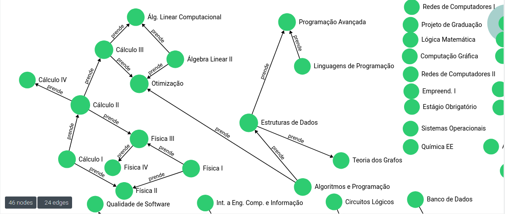
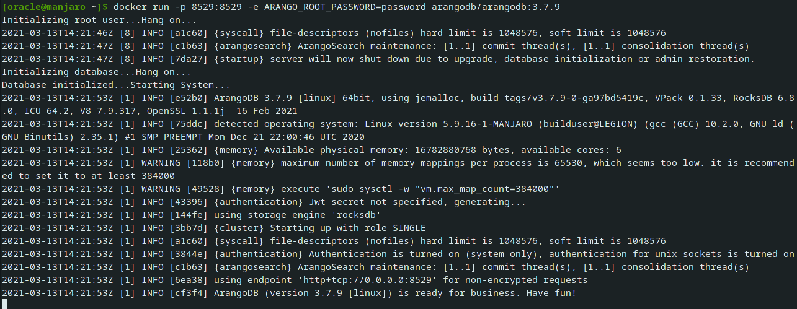

# Graph-Flowchart



## Tabela de conteúdos

<!--ts-->
   * [About](#about)
   * [Requirements](#requirements)
   * [How to use](#how-to-use)
      * [Setting up Arangodb](#arangodb-setup)    
      * [Setting up Program](#program-setup)
   * [Technologies](#technologies)
<!--te-->

## About

This repository is a study abound Graph Databases and Datavisualization, where i was trying to figure out another way to represent a flowchart, where all the students could see easily the requirements of each course in a specific program.

## Requirements

To run this repository by yourself you will need to install python3 in your machine and them install all the requirements inside the [requirements](requirements.txt) file

## How to use

### Arangodb Setup

```bash
# Install Docker in your OS. Pay atenttion on your OS way to install docker
$ sudo pacman -S docker

# Start your Docker service
$ sudo systemctl start docker.service

# Install ArangoDb on your Docker
$ docker pull arangodb/arangodb

# Start Arango session. Note that password should be any root password
$ as docker run -p 8529:8529 -e ARANGO_ROOT_PASSWORD=password arangodb/arangodb:3.7.9

# Then you can access it by your browser where the login is root and your password is the ARANGO_ROOT_PASSWORD variable
```


### Program Setup

```bash
# Clone this repository
$ git clone <https://github.com/DantasB/Graph-Flowchart>

# Access the project page on your terminal
$ cd Graph-Flowchart

# Install all the requirements
$ pip install -r requirements.txt

# Create a .env file
$ touch .env  

# Create the following parameters
 ARANGO_USER #Your Arango user
 ARANGO_PASSWORD #Your Arango password
 CLASSES_PATH #The classes dataset path
 COLLECTION_NAME #The arangodb collection name
 DATABASE_NAME #The arangodb database name
 EDGE_NAME #The arangodb edge collection name
 GRAPH_NAME #The arangodb graph name
 REQUIREMENTS_PATH #The requirements dataset path

# Execute the main program
$ python main.py

# The graph constructor will start and them you can see this in the arangodb page
```


## Technologies

* Python3
* ArangoDB